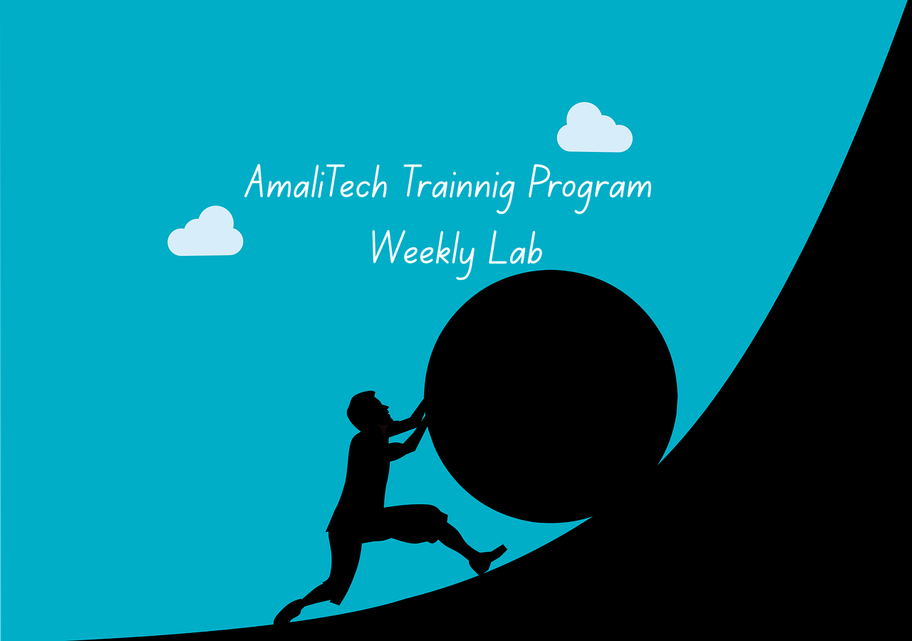

[//]: # (![challenge banner]&#40;image/amaliTechLab.webp&#41;)

# Lab6: Hospital Information System

This lab evolves around designing ERD, using JDBC to set connection of java app to database
such postgres, and perform CRUD operation.
## Video

* Final Project With UI Interface: https://screenrec.com/share/XNnjkexugK

## Usage

* ERD design: https://drive.google.com/file/d/1XzZmL_hR3fYsRsPYEN0rzUqK2_HhgrMU/view?usp=sharing 
* JavaFx UI: Interacting with the app
    - To run the UI, open the "Application" that is inside src/java/com.exampl../Applicaiton
    - After opening the Application class then click on run button.
    - Please make sure you have an updated JDK and javaFx installed.
* Backend codes: Logic behind the UI features
    - Main class is where all the features are demonstrated.
    - database repository has DBConnection class and SchemaCreator 
    - model repository has only Patient as class to perform CRUD operation
    - repository has PatientRepository class, this where all CRUD query is executed.

## Expected Learning Outcomes

- Gain hands-on experience in relational database modeling and SQL queries.
- Learn to integrate a Java application with a database using JDBC.
- Apply best practices for database schema design and normalization.
- Develop the ability to write efficient and secure SQL queries.
- Understand the importance of database constraints and relationships in ensuring data integrity.